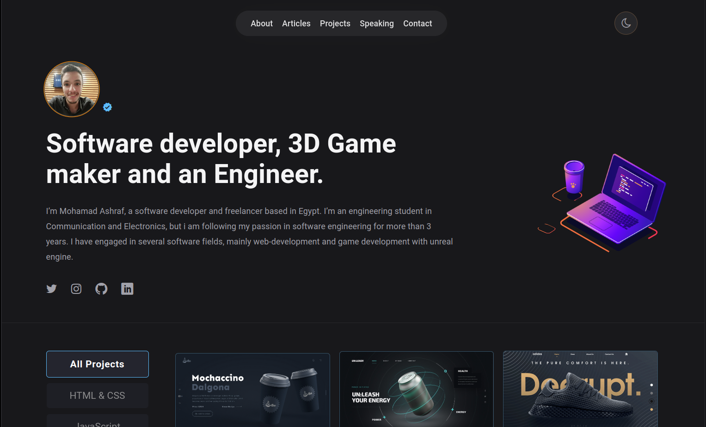

# React Portfolio

This is a personal portfolio website built using React. It showcases projects, skills, and experiences in web development.

## Overview

Here is a screenshot of the portfolio website:




## Features

- **Responsive Design**: The website is fully responsive and works on all devices.
- **Modern UI/UX**: Clean and modern user interface with smooth animations.
- **Project Showcase**: Display of various projects with descriptions and links to live demos and source code.
- **Skills Section**: Highlight of technical skills and proficiencies.
- **Contact Form**: A functional contact form to get in touch.

## Technologies Used

- **React**: JavaScript library for building user interfaces.
- **React Router**: For handling navigation.
- **MUI Components**: For styling the components.

## Installation

1. Clone the repository:
  ```bash
  git clone https://github.com/Mohamad-Shiro/React-Portfolio
  ```
2. Navigate to the project directory:
  ```bash
  cd react-portfolio
  ```
3. Install dependencies:
  ```bash
  npm install
  ```
4. Start the development server:
  ```bash
  npm start
  ```

## Usage

- Visit the website to view the portfolio.
- Navigate through different sections to learn more about the projects and skills.
- Use the contact form to send a message.

## License

This project is licensed under the MIT License.

## Contact

Feel free to reach out if you have any questions or suggestions!

- Email: mohamad.shiro80026@gmail.com
- LinkedIn: [Your LinkedIn Profile](https://www.linkedin.com/in/mohamad-ashraf-mahmoud/)
